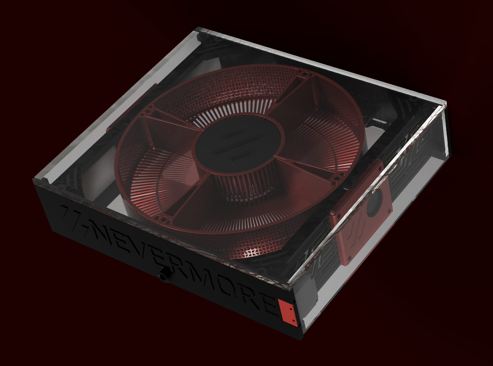

<!--
*** Thanks for checking out the Best-README-Template. If you have a suggestion
*** that would make this better, please fork the repo and create a pull request
*** or simply open an issue with the tag "enhancement".
*** Thanks again! Now go create something AMAZING! :D
-->

<!-- PROJECT SHIELDS -->
<!--
*** I'm using markdown "reference style" links for readability.
*** Reference links are enclosed in brackets [ ] instead of parentheses ( ).
*** See the bottom of this document for the declaration of the reference variables
*** for contributors-url, forks-url, etc. This is an optional, concise syntax you may use.
*** https://www.markdownguide.org/basic-syntax/#reference-style-links
-->

<!-- PROJECT LOGO -->
 

  <https://github.com/0ndsk4/VoronUsers/tree/0ndsk4/printer_mods/0ndsk4/Nevermore_Air_Filter">
    
  </a>

  <h3 align="center">Nevermore Max Air Filter</h3>

<!-- TABLE OF CONTENTS -->

  
Table of Contents

  <ol>
    <li>
      <a href="#About-The-Nevermore">About Nevermore Max</a>
      <ul>
        <li><a href="#Why">Why Nevermore?</a></li>
		<li><a href="#But-we-already-have-a-filtered-exhaust">But we already have a filtered exhaust?</a></li>
		<li><a href="#I-have-worked-with-plastics-and-I-am-fine">I've worked with plastics, and I'm fine!</a></li>
      </ul>
    </li>
    <li>
      <a href="#getting-started">Getting Started</a>
      <ul>
        <li><a href="#BOM">BOM (AND IMPORTANT CARBON INFO)</a></li>
        <li><a href="#installation">Installation</a></li>
		<li><a href="#Built-with">Built with</a></li>
      </ul>
    </li>
    <li><a href="#contributing">Contributing</a></li>
    <li><a href="#license">License</a></li>
  </ol>

<!-- ABOUT THE PROJECT -->
## About Nevermore Max

[![Product Name Screen Shot][product-screenshot]](https://example.com)

What-the-raven is Nevermore? Its another <I>recirculation carbon filter</I> design aimed at cleaning the VOCs produced by the printer REPEATEDLY, instead of using a one-pass exhaust of ever decreasing efficiency. Being the fourth filter design in my filter ventures, I feel this is the best blend of looks, simplicity and pure filtration power yet - all while managing a balanced noise level.
Also check out the smaller Nevermore siblings - Nevermore Micro and Nevermore Mini (TBD).

### Why

At the end of the day, a fresh single-pass filtered exhaust (at brand new) has perhaps 70% VOC removal efficiency while still exhausting 30% of the nasty. A recirculation filter achieving four passes at worn-in 50% efficiency would still remove 94% of the bas stuff. Or 99% at six passes!  
The number of passes you get all depends on how well you can seal your build chamber.  
Some will have a hard time achieving a good chamber seal, which creates the biggest drawback of recirculation filters - they're air flow neutral. Meaning, as nothing pulls air into the chamber, air can diffuse freely to the outside through any remaining gaps. And that air could be <i>zero per cent</I> cleaned...   

To both have the cake and eat it (yes you can!), the Nevermore incorporates a small exhaust fan, that is used to keep a slight negative pressure inside the chamber - air will still just get pulled _into_ the chamber through any remaning cracks, not leak outside. Dont ramp it up high! Its meant to just barely evict air - so that the majority of air flow through the filter is still recirculated.  
The exhaust can also be used to keep the chamber at a set temperature in Mainsails.   
Air evicted through the exhaust will at least have passed through the carbon filter, pre-filter and HEPA filter at least once (hopefully many more times) - so its a good security measure to have if you dont want to bet on your chamber being hermetically sealed.

### But we already have a filtered exhaust?

Yup, but aside from being one-pass, regular mesh carbon filters mainly consists of...mesh. And active carbon sprinkle - miniscule amounts, not meant to be used 24/7 in a 3d printer.   

Just running regular  air through a mesh filter will still depete it in weeks (carbon can't opt to just bind the nasty stuff). Filter exposed to air depletes it too, in time. Friggin' everything depletes carbon filters.  
But hey, if you change the filters bi-weekly and are okay with a more limited filtering capacity, the standard stuff is good too!  

<b>The Nevermore</B> has more than a <i>kilo</i>, or two pounds, of active carbon. Not single-digit grams. And its sealed off from the surroundings, so when its not running, its not depleting. Any off-gassing between prints will likewise be kept inside the filter! And when is does run, it has alot of VOC binding capacity! About five hundred times more.   

This is the filter for the low maintenence crowd (who still want to be safe). /n

### I have worked with plastics and I am fine!

If you live alone - not impacting other people – and feel that way, this filter is not for you!  
After all, you’re perfectly allowed to smoke two packs a day or become a opposition politician in Russia too, even though it’s probably not optimal for your health. And on an individual level one can never be sure what the health effects will be, if any - the oldest person ever used to smoke until she was 118 years or so…

But speaking of what we do know, we can say for sure that: 

The WHO:s <I>International Agency for Research of Cancer (IARC)</i> classifies chemical compounds based on the known evidence of human carcinogenics, into four classes (<I>carcinogenic, probably carcinogenic, possibly carcinogenic or not classifiable as carcinogenic to humans</i>).  
Most chemicals fall into the last category, but in the known carcinogenic groups we find several known 3d printer byproducts:  
&nbsp;&nbsp;&nbsp;&nbsp;&nbsp;&nbsp;&nbsp;<B>o Benzene</b> 
One of the main fumes from ABS printing. 3ppm regarded as safe, whereas up to 280 ppm of VOCs are produced ABS printing every hour in a small space. Proven to cause different leukemias, and suspected of causing a multitude of other cancers. Female workers in a shoe factory exposed to 40ppm for a long time had a hundredfold higher risk of dying from breast cancer, for instance. Class 1 carcinogenic.  
&nbsp;&nbsp;&nbsp;&nbsp;&nbsp;&nbsp;&nbsp;<b>o Styrene</B> 
Main pollutant in ABS fumes, recently upgraded from possible to probable carcinogenic based on mounting evidence of connection with a close to tripled risk of different leukemias.  
&nbsp;&nbsp;&nbsp;&nbsp;&nbsp;&nbsp;&nbsp;<B>o Butadiene</b> 
Another component of ABS printing, and the reason why styrene didn’t get the carcinogenic label for so long (as both are ABS byproducts it was long impossible to know if a cancer type was due to butadiene or styrene. Butadiene is also a known cause and/or cofactor in cardiovascular disease, so you might get your heart attack or stroke a few years earlier by breathing it in for a long time.  
<u>Other knowns:</U>  
&nbsp;&nbsp;&nbsp;&nbsp;&nbsp;&nbsp;&nbsp;• What creates the most particles/VOCs from plastics handling is <i>heated extrusion</i>. 
&nbsp;&nbsp;&nbsp;&nbsp;&nbsp;&nbsp;&nbsp;• Injection molding, vacuum forming and other common industrial methods creates less air pollutants due to less melted plastic surface per kg with direct air/oxygen access/airflow. 
&nbsp;&nbsp;&nbsp;&nbsp;&nbsp;&nbsp;&nbsp;• 3D printing extrusion takes this to another VOC creation level, as you’re extruding thin layer by thin layer, not trapping any of the extruded melted material from access to oxygen or airflow. Thus, per kilogram of product, it’s the most particle and VOC generating plastic process there is. 
&nbsp;&nbsp;&nbsp;&nbsp;&nbsp;&nbsp;&nbsp;• Home 3d printers are often used in places without industrial ventilation or industrial wet scrubbing. Indeed, a recent study showed that levels of VOC carcinogenics in plastics recycling plants using heated extrusion processes were mostly within safe limits. However, in surrounding residential homes of those safe-to-work plants, VOC levels were up to <B>42 times</b> the safe limits and consisted of the ventilated byproducts from the plastic plants, due to lower ventilation requirements in homes. The study showed a clear increased lifetime cancer risk, even for the workers in the plants.  

This is a short list of some key knowns, and only address the most common ABS fumes. Other materials have different VOCs. PETG for instance, releases Toluene, Acetaldehyde, Formaldehyde – all of which are known health hazards. Regular PLA and Nylons without additives are usually safer, but still release lower levels of acetone, methyl-methacrylate, and iso-butanol (PLA) and Propylene Glycol and Cyclopentanone (Nylon). Not all fumes are created equal.  

<!-- GETTING STARTED -->
## Getting Started

You're ready to build a Nevermore? Cool!

### BOM

<B>PANELS</b>  
(any plastic, PC might be best choice for the exterior sheet for the surface to hold up better. PET(G) for everything is most economical and avoids crack-prone acrylic): 
[REFERENCE PRICES FROM INTERGLAS 288X278X6mm PC = €12, 288x278X4mm PETG €5 precut to size (https://interglas.se/shop/polykarbonat-klar-6-753p.html) and (https://interglas.se/shop/pet-g-klar-4-2725p.html)]

* OUTER (4-8mm): 346x300mm 
	Thick: Better noise dampening. 
	Thin: Lighter.  
* 2 SIDES  (6MM): 288 X 70 mm  
* MIDDLE (6MM, OR 4+2mm dampening): 288 X 278 mm 
* BACK (4MM, OR 2+2mm dampening, or even totally optional as its just there to be a noise barrier combined with the enclosure panel): 288 X 278 mm  

<B>FANS</b> 
* CENTER fan: Any generic 65x25mm radial GPU fan. **DELTA BFB0712HF 65mm would work fine.** 
* Rubber grommets for PC cases to decouple the center fan vibrations from the panels. 
* RECIRCULATION fans: TWO 5015 blowers or your choice. 
* EXHAUST FAN: A single 4010 blower.  
<B>CARBON AND FILTERS</b> 
* Active carbon: ***4mm pellets*** (ebay/amazon, available on bulk. Slightly more than 1 kg/2 pounds to fill the filter, and a quarter of that per four months from there on. 
* **IMPORTANT**! Since first release the *varying quality carbon out there has become increasingly evident*. Users has both gotten bad carbon as well as outright dangerous stuff (in one case oxidizing most metal surfaces in a new voron in minutes. Be sure to vet your carbon supplier! 
* *Optimal carbon* for 3D printer VOC adsorbtion is sourced from ***virgin coconut***, not wood/bitumen/charcoal/bamboo/lignin/etc. The porosity for each and every source will vary greatly (i.e, for aquarium or moonshine use you want large macroporosity to filter larger impurities, like oils. For that reason, water/liquid use carbon  has a large macropore area, defined as >100nm. Printer VOCs are generally less than 0.5 nm, meaning that for optimal capture rate and efficiency we want carbon with a high *microporosity* ratio, defined as <1nm). A higher **iodine count** >1000 usually indicates at least some micro/mesoporosity, and a higher **hardness** (>95%) will create less dust in air filtration. CTC number doesnt translate well to our VOCs, but toluene adsorbtion - which sometimes is available - is a good metric.
* **Avoid acid washed carbon**. Residues have oxidized printers! Go for steam activated, non acid-washed. A blend of neutral carbon and alkaline KOH carbon might be the best blend in the future, but impossible to currently source from trustworthy manufacturers.
* Finding carbon that fills all criteria is hard, but will hopefully become easier in time (working on that). Look around, ask suppliers about the carbon, hear what others recommend.

* **HEPAs**: 4x *Chuwi iLife 40x80mm* filters (get a ten pack for three bucks on ali) 
Example Seller: https://www.aliexpress.com/item/1005001615722382.html 

<B>PRINTED PARTS:</b> 
* 300mm voron required for now (it'll fit a 250 but take up most of the panel its mounted on). In the future I'll make a two-pieced mod. 
* Print solid. The top/Bottom plates are 6mm thick, same as panels. Hollow/infilled panels doesnt dampen as well.  
### Installation

...TBC... The filter as of yet is an early alpha, subject to change. Builds and feedback are appreciated, but most parts will probably be subject to future change.

### Built with
The Voron nevermore Air Filter was modelled in Fusion 360.
* [Fusion 360](http://autodesk.com)

<!-- USAGE EXAMPLES -->

<!-- CONTRIBUTING -->
## Contributing

Please contribute! I'd like to incorporate VOC sensors, making the filter smart (running on low-noise mode at an acceptable VOC level, then ramp up at the end to clean more thoroughly before doors open).

<!-- LICENSE -->
## License

Distributed under GNU General Public License version 3.0 (GPLv3)

<!-- CONTACT -->
## Contact

0ndsk4#5933  - (http://discord.com/user/0ndsk4#5933)  
Nevermore: [https://github.com/0ndsk4/VoronUsers/tree/0ndsk4/printer_mods/0ndsk4/Nevermore_Air_Filter](https://github.com/0ndsk4/VoronUsers/tree/0ndsk4/printer_mods/0ndsk4/Nevermore_Air_Filter)

<!-- ACKNOWLEDGEMENTS -->
## Acknowledgements
* [The Voron Dev Team](https://vorondesign.com/)

<!-- MARKDOWN LINKS & IMAGES -->
<!-- https://www.markdownguide.org/basic-syntax/#reference-style-links -->

[product-screenshot]: images/screenshot.png
